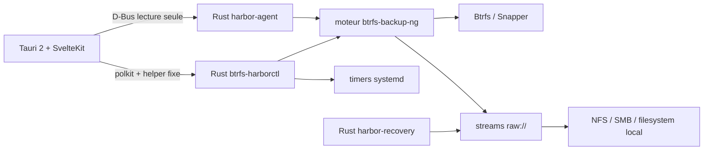

<p align="center">
  
</p>

<h1 align="center">Btrfs Harbor</h1>

<p align="center">
  <strong>⚓ Snapshots in. Systems back.</strong><br>
  Sauvegarde, vérification, récupération et réplication Btrfs pour Linux.
</p>

<p align="center">
  <a href="https://github.com/GodsQuantum/btrfs-harbor/actions/workflows/harbor.yml"></a>
  <a href="LICENSE"></a>
  
  
  
  
</p>

<p align="center">
  <a href="README.md">English</a> ·
  <a href="README.fr.md">Français</a> ·
  <a href="README.zh-CN.md">简体中文</a>
</p>

<p align="center">
  
</p>

Btrfs Harbor transforme les **snapshots locaux Btrfs/Snapper en vraies sauvegardes hors machine**. Il regroupe destinations contrôlées, flux Btrfs complets + incrémentaux, vérification, planification systemd, récupération en staging et réplication LXC Proxmox dans une application desktop native.

Un snapshot local sur le même disque est utile, mais ce n’est **pas** une sauvegarde hors machine. Harbor conserve cette distinction partout dans l’interface.

## ✨ Pourquoi Harbor ?

- **Sauvegardes Btrfs full + incrémentales** — la filiation des snapshots est conservée.
- **Destinations NFS / SMB / local / SSH** — y compris des streams raw sur un filesystem classique.
- **Pas de fallback NAS silencieux** — la destination réseau est identifiée avant toute écriture.
- **Vérification intégrée** — checksum optionnel après la sauvegarde.
- **Planification persistante** — services et timers systemd natifs par UUID.
- **Recovery Kits** — topologie, paquets, Snapper et notes de boot à côté des sauvegardes.
- **Récupération en staging** — restauration et vérification séparées du root live.
- **Réplication LXC Proxmox** — déploiement vers un conteneur arrêté avec snapshot/rollback natif.
- **Desktop à privilèges minimaux** — D-Bus en lecture + helper privilégié fixe, aucun shell root générique.
- **English / Français / 简体中文** — UI et documentation complètes.
- **Aucun runtime Docker** — Harbor s’installe comme une application Linux native.

## 📦 Télécharger et installer

Sur la plupart des Linux x86_64, utilise l’**installateur universel**. Il installe ensemble l’application desktop, les helpers Rust, le moteur de sauvegarde hérité, le service systemd, la politique D-Bus et l’intégration polkit :

```bash
curl -LO https://github.com/GodsQuantum/BTRFS-Harbor/releases/download/v0.1.1/BTRFS-Harbor-0.1.1-linux-x86_64.run
chmod +x BTRFS-Harbor-0.1.1-linux-x86_64.run
./BTRFS-Harbor-0.1.1-linux-x86_64.run
```

L’installateur universel cible **Linux x86_64 avec glibc + systemd**. Il peut installer les outils système requis via pacman, apt, dnf ou zypper. Alpine/musl et les systèmes sans systemd ne sont pas pris en charge actuellement.

La release fournit aussi :

- **DEB** — Debian / Ubuntu et dérivées.
- **RPM** — Fedora / famille RHEL / workflows compatibles openSUSE.
- **AppImage portable** — se lance directement et **n’installe pas Harbor**. Elle permet d’inspecter l’ordinateur et de préparer la sauvegarde. Au moment d’activer les sauvegardes planifiées, Harbor peut installer lui-même le paquet système complet, ou tu peux utiliser directement le `.run`, `.deb` ou `.rpm`.
- **SHA256SUMS** — checksums de tous les artefacts Linux.

## 🚀 Compilation depuis les sources sur CachyOS / Arch Linux

L’installation recommandée depuis les sources utilise le paquet Arch fourni par le repo :

```bash
git clone https://github.com/GodsQuantum/btrfs-harbor.git
cd btrfs-harbor
./install-cachyos.sh
```

Le script :

1. vérifie qu’il tourne sur un système utilisant pacman ;
2. installe uniquement les prérequis Arch standards ;
3. compile le `PKGBUILD` avec `makepkg` sous ton utilisateur normal ;
4. installe le paquet avec pacman ;
5. active le service natif `btrfs-harbor-agent.service` ;
6. supprime le dossier temporaire de build.

Ensuite, lance **Btrfs Harbor** depuis le menu des applications ou :

```bash
btrfs-harbor
```

> Les actions privilégiées utilisent polkit. Ne lance pas l’interface desktop en root.

## 🛟 Première sauvegarde

1. Ouvre Harbor. Il identifie l’ordinateur courant et scanne ses **subvolumes Btrfs montés**.
2. Vérifie ce qu’Harbor a détecté. Les configurations et snapshots **Snapper** existants sont reconnus ; les snapshots read-only utilisables par `btrfs send` sont indiqués explicitement.
3. Choisis ce que tu veux protéger. Harbor présélectionne les sources Btrfs persistantes recommandées et masque les montages de type cache/jetable dans la vue simple.
4. Choisis la destination. Les destinations **NFS/SMB déjà montées** sont proposées automatiquement avec leur vrai point de montage et l’identité serveur/share ; tu peux aussi choisir un autre dossier.
5. En mode **Simple**, Harbor applique des valeurs sûres : sauvegarde automatique quotidienne à 02:00 et vérification activée. Passe en **Avancé** uniquement si tu veux modifier planning, rétention ou options bas niveau.
6. Clique **Enregistrer et activer**. Si tu as lancé l’AppImage portable, Harbor installe d’abord l’intégration système complète via polkit, puis applique directement les choix que tu viens de faire.
7. Lance une première sauvegarde manuelle et vérifie qu’elle passe à **SAUVEGARDÉ** puis **VÉRIFIÉ**.
8. Fais un test de restauration en staging avant de considérer Harbor comme validé pour des données uniques.

Aucune IP de démonstration, aucun nom de machine et aucun chemin source ne sont préremplis dans le premier lancement natif : Harbor utilise la machine sur laquelle il tourne réellement.

## 🧭 Comprendre les statuts

| État | Signification |
| --- | --- |
| **LOCAL** | Snapshot uniquement sur la machine source |
| **SAUVEGARDÉ** | La destination contient le stream |
| **VÉRIFIÉ** | Le stream raw stocké a passé la vérification |
| **COMPLET** | Envoi full indépendant |
| **INCRÉMENTAL** | Envoi basé sur une chaîne de parent valide |
| **RESTAURATION TESTÉE** | Une restauration en staging a réussi |

## 🧬 System Replica

Harbor peut réutiliser le userspace Linux sur une autre cible sans considérer l’état matériel comme portable.

- **Machine physique** — userspace + réconciliation explicite boot/hardware.
- **VM** — userspace + adaptation au matériel virtuel.
- **LXC** — userspace uniquement ; EFI et noyau physiques sont exclus.

Pour un LXC Proxmox arrêté, Harbor peut créer un snapshot PVE de rollback, monter le rootfs cible, préserver réseau/hostname, respecter le namespace UID/GID réel du conteneur, réinitialiser machine-id et clés SSH hôte, puis rollback automatiquement en cas d’échec.

## 🛡️ Modèle de sécurité

### Pas de fallback local silencieux

Pour NFS/SMB, Harbor mémorise le point de montage **et** le serveur/share attendu. Le helper contrôle la table de montages live avant la sauvegarde. La configuration générée utilise aussi `require_mount`.

### Pas de shell root générique

Le desktop reste non privilégié. Les lectures passent par un service D-Bus système étroit. Les mutations passent uniquement par des commandes Harbor fixes et validées via polkit.

### Récupération en staging

```text
plan → vérification de chaîne → restauration en staging → vérification → réconciliation → activation
```

Harbor refuse d’écraser le root en cours d’exécution.

### Pas de secrets dans les Recovery Kits

Les Recovery Kits contiennent l’intention système et la topologie, jamais les fichiers de credentials.

## 🏗️ Architecture



Harbor est basé sur [berrym/btrfs-backup-ng](https://github.com/berrym/btrfs-backup-ng). Le moteur Python upstream conserve la logique sensible send/receive, rétention, metadata raw, locks et restore ; Harbor ajoute un control-plane Rust et un desktop natif.

## ⚙️ Configuration d’exemple

Une configuration totalement générique est disponible dans [examples/harbor.toml](examples/harbor.toml).

La configuration active est stockée sous :

```text
/etc/btrfs-harbor/harbor.toml
```

Les profils moteur générés sont stockés sous :

```text
/var/lib/btrfs-harbor/generated/
```

## 🧪 Développement

```bash
uv sync --frozen --extra test --extra dev
uv run --frozen pytest -q

cd harbor
cargo test --workspace --exclude btrfs-harbor-desktop --locked

cd desktop
pnpm install --frozen-lockfile
pnpm test
pnpm check
pnpm build
```

## 📦 État du projet

Btrfs Harbor est une **v0.1** publique précoce. Les chemins principaux de sauvegarde, vérification, récupération en staging et réplication LXC arrêté ont été exercés sur des environnements de test jetables.

**Ne fais jamais d’un outil de sauvegarde non stabilisé l’unique copie de données importantes.** Garde une autre sauvegarde et valide une restauration réelle.

## 🤝 Héritage upstream

Btrfs Harbor est basé sur **btrfs-backup-ng** de Michael Berry et ses contributeurs. Le moteur upstream reste sous licence MIT et son historique est préservé. Son README original est conservé dans [docs/upstream/UPSTREAM_ENGINE_README.md](docs/upstream/UPSTREAM_ENGINE_README.md).

## 📄 Licence

MIT — voir [LICENSE](LICENSE).
