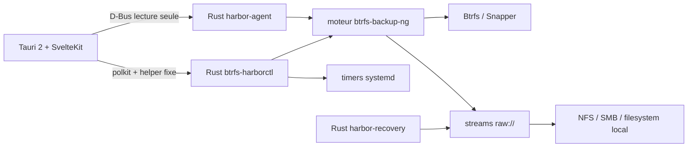

<p align="center">
  
</p>

<h1 align="center">Btrfs Harbor</h1>

<p align="center">
  <strong>⚓ Snapshots in. Systems back.</strong><br>
  Sauvegarde, vérification, récupération et réplication Btrfs pour Linux.
</p>

<p align="center">
  <a href="https://github.com/GodsQuantum/btrfs-harbor/actions/workflows/harbor.yml"></a>
  <a href="LICENSE"></a>
  
  
  
  
</p>

<p align="center">
  <a href="README.md">English</a> ·
  <a href="README.fr.md">Français</a> ·
  <a href="README.zh-CN.md">简体中文</a>
</p>

<p align="center">
  
</p>

Btrfs Harbor transforme les **snapshots locaux Btrfs/Snapper en vraies sauvegardes hors machine**. Il regroupe destinations contrôlées, flux Btrfs complets + incrémentaux, vérification, planification systemd, récupération en staging et réplication LXC Proxmox dans une application desktop native.

Un snapshot local sur le même disque est utile, mais ce n’est **pas** une sauvegarde hors machine. Harbor conserve cette distinction partout dans l’interface.

## Branche preview après rc.11 (NON PUBLIÉE, expérimentale, 10 octobre 2026)

La branche de développement contient de nouvelles modifications **absentes des paquets rc.11 déjà publiés**. Les CI vertes ne constituent pas une nouvelle version stable.

- **Restauration d'un Ubuntu 24.04 installé** : [CI GitHub](https://github.com/GodsQuantum/BTRFS-Harbor/actions/runs/38088918085) installe un véritable Ubuntu avec systemd, sauvegarde Btrfs et EFI, restaure sur un AUTRE disque GPT et réussit deux boots UEFI sous OVMF. Arch/CachyOS, Fedora, Limine, systemd-boot, LUKS, UKI et Secure Boot ne sont pas encore certifiés.
- **Miroir SSH-v2 expérimental restreint** : [CI SSH avec pannes réelles](https://github.com/GodsQuantum/BTRFS-Harbor/actions/runs/38088918056) valide la commande forcée, la clé hôte épinglée, les blocs SHA-256, l'arrêt du serveur et la reprise. La copie s'effectue depuis des **archives checkpoint-v2 déjà complètes en local/NFS** ; ce n'est pas encore une destination SSH directe du bouton principal. Voir le [guide SSH](docs/SSH_V2_OPERATOR_2026-10-10.md).
- **Laboratoire de rétention transactionnelle** : [CI de crash sur runner jetable](https://github.com/GodsQuantum/BTRFS-Harbor/actions/runs/38089399910), journal durable, quarantaine privée, refus des fichiers étrangers et reprise. **Suppression automatique désactivée** tant que l'exclusion des lectures/écritures concurrentes et la planification ne sont pas qualifiées.
- **GUI non encore certifiée** : systray KDE Wayland/X11 en vraie session, progression, installation des paquets dans des VM jetables et autres chargeurs UEFI. Conserver une sauvegarde indépendante et vérifiée.

## v0.2.6-rc.11 (préversion publiée) — ISO de secours et restauration ReaR

**Publiée le 10 octobre 2026 :** [version officielle v0.2.6-rc.11](https://github.com/GodsQuantum/BTRFS-Harbor/releases/tag/v0.2.6-rc.11) avec AppImage, DEB, RPM, .run et SHA256SUMS vérifiés. La branche stable `main` reste en v0.2.5. Cette version **ne certifie pas** la restauration universelle sans intervention.

- **Sauvegarder maintenant** conserve les volumes Btrfs et les partitions EFI montées.
- Un bouton **Créer ISO de secours** utilise ReaR 2.9 avec une configuration propre à Harbor, sans modifier /etc/rear. ISO construite localement puis copiée sur la destination avec contrôles de montage, ISO9660 et SHA-256.
- L'outil intégré à l'ISO prépare la restauration Btrfs + EFI, vérifie les UUID et adapte fstab aux nouveaux volumes. ReaR doit ensuite finaliser le chargeur de démarrage et l'initramfs.
- **Test de démarrage sur disque vierge réussi pour un Linux minimal** : après restauration Btrfs + EFI sur un autre disque GPT et correction des UUID, deux démarrages UEFI QEMU/OVMF ont atteint /sbin/init ([preuve CI](https://github.com/GodsQuantum/BTRFS-Harbor/actions/runs/38058403995)). **Ce n'est pas une certification universelle :** systèmes installés CachyOS/Arch, Ubuntu/Fedora, LUKS, UKI, autres chargeurs de démarrage, données non-Btrfs, rétention automatique et SSH-v2 restent à qualifier. Conserver une sauvegarde indépendante.

**Notes des versions précédentes (rc.10 et antérieures) :** les fonctions indiquées comme absentes ou non publiées ci-dessous décrivent l'état de **chaque ancienne version à sa sortie**, pas celui de rc.11.

## v0.2.6-rc.10 — capture EFI et fichiers de démarrage

- **Sauvegarder maintenant** inclut les volumes Btrfs et les partitions EFI FAT32 ou /boot séparées montées, dans la transaction de sauvegarde existante.
- Les archives EFI sont vérifiées en SHA-256 et récupérables dans un dossier vide sans écraser les partitions originales. Une partition déclarée dans /etc/fstab mais non montée provoque une erreur.
- **La restauration amorçable sur disque vierge n'est pas encore certifiée** : il faut valider la reconstruction GPT/LUKS, GRUB/Limine/systemd-boot, initramfs et UEFI dans QEMU/OVMF. Autres volumes non-Btrfs, SSH reprenable et purge automatique restent à finaliser.

## v0.2.6-rc.9 — Sauvegarder maintenant sur l'accueil

- Le bouton principal **Sauvegarder maintenant** sauvegarde les sous-volumes Btrfs persistants détectés avec la transaction multivolume v2 existante.
- Les utilisateurs de snapshots Btrfs natifs voient désormais la sauvegarde même sans Snapper.
- Un seul clic reprend d'abord la sauvegarde interrompue lorsqu'elle est unique ; plusieurs sauvegardes imposent un choix. L'identité du montage de destination est vérifiée.
- Préversion : EFI, partitions non-Btrfs et restauration amorçable non inclus ; SSH reprenable et rétention automatique non finalisés.

## v0.2.6-rc.8 — préversion supervisée et reprise Btrfs/NFS

- Les chaînes incrémentales v2 sont limitées à **7 niveaux par défaut** : Harbor crée alors une nouvelle base complète autonome (réglable de 1 à 256). Le plan de rétention est consultable sans suppression ; la purge automatique reste désactivée.

- Les identifiants des snapshots multivolumes sont enregistrés **avant**
  leur création ; une coupure ne les laisse plus sans catalogue récupérable.
- La préparation des destinations des tâches installées se fait avec des
  descripteurs vérifiés : montage disparu, lien symbolique et traversée de
  chemin sont refusés.
- Un test intégral sur un **véritable NFSv4 jetable**, hébergé par GitHub,
  a réussi : SIGKILL, démontage/remontage, reprise sans perdre les checkpoints
  validés et comparaison SHA-256 des données restaurées.
- Des tests séparés couvrent le démontage à chaud et le manque d'espace.
- Chaque profil planifié peut activer explicitement le moteur de reprise v2
  dans les options avancées. Les profils déjà installés ne changent pas par défaut.
- Le Recovery Kit écrit ses documents atomiquement à travers des descripteurs
  contrôlés : aucun repli sur le disque local si le NAS disparaît.
- Les tests réels comprennent l'arrêt du serveur NFS en plein transfert,
  101 essais Btrfs privilégiés, les coupures multivolumes et le manque d'espace.
- Attention : le mode planifié v2 **n'applique pas encore la rétention**
  configurée. SSH-v2 et restauration amorçable restent non certifiés.
  Voir docs/RESEARCH_BOOT_REAR_2026-10-10.md.

**Non stabilisé :** reconstruction amorçable UEFI, migration SSH et tâches
planifiées vers les checkpoints v2, et coupure du serveur pendant une écriture.
Les changements ci-dessus ne sont pas dans le binaire rc.7 déjà publié.

## v0.2.6-rc.7 — préversion supervisée des ensembles Btrfs

L'interface native propose **Sauvegarder tous les volumes Btrfs** :
un catalogue durable par ensemble, des sauvegardes complètes puis
incrémentales avec parent vérifié pour chaque sous-volume Btrfs monté,
la reprise, puis la **restauration depuis la destination seule** dans un
dossier Btrfs vide. Le profil de l'ancien ordinateur n'est pas nécessaire.
L'envoi et la restauration réels de sous-volumes imbriqués root/home sont testés.

**Limites explicites :** partitions EFI et non-Btrfs, volumes déconnectés ou non
montés, SSH et anciennes tâches planifiées non couverts. La reconstruction
amorçable, une vraie coupure/reprise NFS et le systray graphique restent à
valider. Ne pas en faire l'unique sauvegarde. Il s'agit d'une préversion supervisée ; la stable v0.2.5 reste inchangée.

## v0.2.6-rc.6 — restauration des archives historiques

La restauration sans profil reconnaît les noms originaux d'archives contenant des points, des espaces ou des caractères accentués, sans autoriser la traversée de dossiers. Un nouveau test Btrfs privilégié vérifie le vrai moteur de sauvegarde Harbor, les incrémentaux et la restauration à partir de la destination seule. La restauration système amorçable et les coupures réseau restent à qualifier.

## v0.2.6-rc.5 — sauvegarde simple, Btrfs natif et restauration sans profil (préversion supervisée)

- Accueil simplifié : snapshot récent, précis ou nouveau ; dossier de destination local/NFS/SMB choisi directement ; bouton Envoyer. Diagnostics et profils restent accessibles ailleurs.
- Lecture native des snapshots Snapper sur l'hôte. Sans Snapper, Harbor sait lister/créer ses propres snapshots Btrfs en lecture seule sur les **racines de sous-volumes Btrfs**. Aucun montage ou réglage Snapper modifié.
- Destination protégée par une identité de montage persistante, y compris pour les disques amovibles ; création par descripteur de dossier ; systray et reprise par checkpoints, sans faux pourcentage.
- Sur une installation Linux neuve, sélection d'un dossier d'archives Harbor et restauration dans un **dossier Btrfs de préparation**, sans ancien profil. Cela ne remplace pas encore automatiquement un disque système amorçable.
- **Limites :** sous-volumes à sélectionner séparément, SSH/planification encore historiques, tests réels de coupure NFS/reprise à terminer, EFI/chargeur de démarrage non restaurés automatiquement. Conserver les sauvegardes validées.

## v0.2.6-rc.4 — destinations persistantes en mode portable

- Le mode AppImage mémorise et recharge son profil de sauvegarde **sans installer de service système**. La configuration est validée et écrite atomiquement dans le dossier standard de configuration utilisateur avec des permissions privées.
- La commande reprenable refuse un dossier non configuré, la racine du système ou un chemin mal formé avec deux barres obliques. Un message explicite remplace l'erreur cryptique de fichier introuvable.
- Le bouton de sauvegarde apparaît aussi dans l'Overview du mode portable lorsqu'une source Snapper est configurée. Aucun minuteur n'est activé et les sources sans Snapper ne sont pas annoncées comme protégées.
- Aucun changement de montage et aucune suppression des anciens fichiers partiels.

## v0.2.6-rc.3 — correctif de compatibilité NFS

Corrige **le bouton « Envoyer le dernier » qui ne démarrait pas sur certains partages NFSv4** : ceux-ci refusent renameat2 NOREPLACE (EINVAL). Harbor utilise désormais une **solution de repli atomique par lien physique, sans écrasement**, dans le même dossier et sans modifier le montage. Si aucun partiel ni journal n’a été créé, les protections Snapper sont libérées après vérification de l’identité du montage. Les tests Btrfs/NFS réels complets restent à effectuer.

## v0.2.6-rc.2 — préversion de sauvegarde Btrfs reprenable

**Une seule commande manuelle principale** dans l’Overview : envoyer le dernier snapshot Snapper stable, mettre en pause, arrêter et reprendre. Le bouton manuel historique concurrent a été supprimé. **Le premier envoi est une sauvegarde complète autonome** ; ensuite Harbor choisit automatiquement l’incrémental si une base distante fiable et son snapshot parent local protégé existent, sinon il effectue un nouveau complet. Les deux snapshots source et parent sont protégés contre le nettoyage Snapper jusqu’à la fin. La progression est relue depuis les manifests après réouverture de l’application ; les diagnostics et réglages techniques sont repliés par défaut. Les sources sans Snapper sont explicitement indiquées comme **non incluses**, jamais présentées à tort comme sauvegardées.

**Limites actuelles :** la commande manuelle unifiée ne traite encore que les sources raw locales/NFS/SMB configurées dans Snapper. Les sources sans Snapper, les timers systemd existants et les anciens transferts SSH ne sont **pas encore migrés** au moteur reprenable. La restauration Btrfs complète et la coupure NFS réelle restent à qualifier : préversion à tester, pas une unique sauvegarde de secours. L’extinction automatique après sauvegarde **n’est pas activée** dans cette version. La v0.2.6-rc.1 reste disponible en repli.

## v0.2.6-rc.1 — préversion avec reprise par checkpoints

**Commandes desktop expérimentales :** envoyer le dernier snapshot Snapper stable, choisir un numéro, créer un snapshot, mettre en pause, arrêter, reprendre ou abandonner explicitement un partiel. Historique lit les vrais manifests, y compris privés via polkit. Les protections Snapper préservent les sources inachevées. Le bouton classique Sauvegarder maintenant et les timers systemd existants utilisent toujours le moteur historique ; ils ne déclenchent PAS un envoi v2.

**CLI expérimentale :** raw checkpoint-v2 start/resume/list/status/pause/stop/discard. Start et Resume exigent --experimental, les destinations locales non réseau --allow-local, et Discard une confirmation. Resume recalcule et vérifie le flux Btrfs depuis zéro localement, mais ne renvoie PAS les frames déjà validées sur la destination. Un ancien fichier .part v0.2.5 sans manifest reste non reprenable.

**Limites de cette préversion :** essais réels Btrfs send/receive interrompu, coupure NFS, timers systemd v2 indépendants et qualification multi-distribution encore à réaliser. Pour essai sous surveillance uniquement, jamais comme unique sauvegarde. Les fonctions raw/SSH stables restent inchangées.

## ✨ Pourquoi Harbor ?

- **Sauvegardes Btrfs full + incrémentales** — la filiation des snapshots est conservée.
- **Destinations NFS / SMB / local / SSH** — y compris des streams raw sur un filesystem classique.
- **Pas de fallback NAS silencieux** — la destination réseau est identifiée avant toute écriture.
- **Vérification intégrée** — checksum optionnel après la sauvegarde.
- **Planification persistante** — services et timers systemd natifs par UUID.
- **Recovery Kits** — topologie, paquets, Snapper et notes de boot à côté des sauvegardes.
- **Récupération en staging** — restauration et vérification séparées du root live.
- **Réplication LXC Proxmox** — déploiement vers un conteneur arrêté avec snapshot/rollback natif.
- **Desktop à privilèges minimaux** — D-Bus en lecture + helper privilégié fixe, aucun shell root générique.
- **English / Français / 简体中文** — UI et documentation complètes.
- **Aucun runtime Docker** — Harbor s’installe comme une application Linux native.

La candidate supervisée **v0.2.6-rc.7** (artefacts à vérifier) sait utiliser Snapper ou les snapshots Btrfs natifs de Harbor sur une racine de sous-volume vérifiée. **Les sous-volumes multiples, la reprise après vraie coupure NFS, la restauration système complète et la compatibilité de toutes les distributions ne sont pas encore qualifiés.**

## 📦 Télécharger et installer

Le moyen le plus simple de **tester Harbor ou faire des sauvegardes manuelles** est l’**AppImage portable**. Elle reste portable : son lancement n’installe rien. Elle détecte Btrfs/Snapper, permet de choisir les sources et la destination, de la valider, de lancer **Sauvegarder maintenant**, de parcourir les snapshots sauvegardés et de préparer une restauration. Les opérations Btrfs privilégiées demandent polkit seulement quand c’est nécessaire.

Si tu fermes la fenêtre Harbor pendant une sauvegarde manuelle en cours, Harbor indique que la sauvegarde **continue en arrière-plan**, masque la fenêtre et conserve un **tray temporaire**. Son menu permet de rouvrir Harbor ou **d’arrêter la sauvegarde active**. Le tray disparaît automatiquement à la fin.

Installe Harbor sur le système uniquement si tu veux des **sauvegardes planifiées qui démarrent toutes seules** lorsque Harbor n’est pas ouvert : planification systemd, démarrage et déclenchement après chaque snapshot Snapper.

La release fournit :

- **AppImage portable** — sauvegarde manuelle + récupération sans installation système.
- **Installateur universel `.run`** — Linux x86_64 glibc + systemd ; installe l’automatisation persistante.
- **DEB** — Debian / Ubuntu et dérivées.
- **RPM** — Fedora / famille RHEL / openSUSE.
- **SHA256SUMS** — checksums de tous les artefacts.

Installateur universel :

```bash
curl -LO https://github.com/GodsQuantum/BTRFS-Harbor/releases/download/v0.2.5/BTRFS-Harbor-0.2.5-linux-x86_64.run
chmod +x BTRFS-Harbor-0.2.5-linux-x86_64.run
./BTRFS-Harbor-0.2.5-linux-x86_64.run
```

Harbor **préfère un `btrfs-backup-ng` système compatible (>= 0.9.12)** s’il existe déjà. Sinon il utilise le moteur compatible embarqué. Harbor ne remplace plus et n’entre plus en conflit avec un moteur upstream installé par l’utilisateur.

**Parcours utilisateur attendu :** [Sauvegarder → reprendre → restaurer](docs/PRODUCT_FLOW_SIMPLE.md). La préversion n'a pas encore validé toutes les étapes.\n\n## 🐧 Support Linux

Harbor raisonne par **capacités disponibles**, pas par nom de distribution.

- **Sauvegarde manuelle + récupération :** Linux + outils Btrfs et capacités nécessaires au workflow choisi. L’AppImage portable ne nécessite aucune installation Harbor.
- **Planification automatique persistante :** nécessite en plus systemd. Sur un Linux Btrfs sans systemd, sauvegarde et récupération manuelles restent disponibles ; Harbor indique simplement que la planification automatique n’est pas disponible.
- **Familles Tier A :** Arch/CachyOS, Debian/Ubuntu, Fedora et openSUSE servent de familles glibc/systemd/Btrfs représentatives.
- **Validation de compatibilité :** les tests CI des quatre familles vérifient seulement la présence du gestionnaire de paquets et la syntaxe de l’installateur. Ils ne prouvent **pas** les envois complets/incrémentaux, la reprise ni la restauration réels. L’AppImage publiée cible actuellement Linux x86_64/glibc, pas toutes les architectures ni musl ; ces plateformes doivent être qualifiées séparément.

Voir [les validations de portabilité requises](docs/PORTABILITY_AND_RELEASE_GATES.md) avant de déclarer une distribution totalement prise en charge.
- **Autres distributions glibc/systemd :** support selon les capacités détectées, sans allowlist.
- **Installation :** le `.run` universel détecte pacman, apt, dnf ou zypper. Les paquets DEB/RPM/Arch restent des canaux natifs optionnels.

L’ancien nom `install-cachyos.sh` est conservé uniquement comme shim de compatibilité et délègue à `install-linux.sh`. Il ne contient plus de logique d’installation spécifique à CachyOS.

## 🛠️ Compilation depuis les sources

La compilation source est destinée aux contributeurs et packagers et utilise la même toolchain Python, Rust et Svelte/Tauri que la section **Développement**. Le `packaging/arch/PKGBUILD` reste disponible pour les utilisateurs Arch, mais ce n’est pas la couche de portabilité de Harbor.

> Les actions privilégiées utilisent polkit. Ne lance pas l’interface desktop en root.

## 🛟 Première sauvegarde

1. Ouvre Harbor. Il identifie la machine courante et détecte ses **subvolumes Btrfs**, ses configurations Snapper et les snapshots read-only utilisables par `btrfs send`.
2. Dans **Ce qui sera sauvegardé**, vérifie les subvolumes persistants détectés. Les libellés humains passent avant `@`, chemins et détails Snapper.
3. Choisis la destination :
   - **Dossier** — choisis un seul répertoire puis clique **Valider**. Harbor détecte local/NFS/SMB en interne sans afficher la plomberie de montage.
   - **Serveur SSH** — renseigne hôte, utilisateur, port et dossier distant, puis teste la connexion.
4. Clique **Sauvegarder maintenant**. Cela fonctionne depuis l’AppImage portable sans installer Harbor.
5. Si tu veux des sauvegardes récurrentes/en arrière-plan, choisis la fréquence puis clique **Installer Harbor pour les sauvegardes automatiques**.
6. Vérifie que le premier envoi passe à **SAUVEGARDÉ** puis **VÉRIFIÉ**.
7. Ouvre **Récupérer**, choisis un vrai snapshot sauvegardé et fais un test de restauration en staging.

Le premier lancement natif n’affiche aucune IP de démonstration, aucun dossier récent, aucun nom de machine ni chemin privé.

## 🧭 Comprendre les statuts

| État | Signification |
| --- | --- |
| **LOCAL** | Snapshot uniquement sur la machine source |
| **SAUVEGARDÉ** | La destination contient le stream |
| **VÉRIFIÉ** | Le stream raw stocké a passé la vérification |
| **COMPLET** | Envoi full indépendant |
| **INCRÉMENTAL** | Envoi basé sur une chaîne de parent valide |
| **RESTAURATION TESTÉE** | Une restauration en staging a réussi |

## ♻️ Récupérer un snapshot

L’onglet **Récupérer** lit réellement le dépôt de sauvegarde et liste les snapshots disponibles du plus récent au plus ancien. La récupération commence par distinguer **remplacer cette machine** (par exemple un NVMe neuf dans le même ordinateur) de **migrer vers une autre machine**. Une migration demande un nouveau hostname et planifie la régénération/adaptation de l’identité machine, des clés SSH hôte, des références UUID de stockage, de l’initramfs et du boot pour que la machine source et la machine restaurée puissent coexister sans conflit.

Choisis ensuite le subvolume, la destination et le snapshot exact, puis restaure-le dans un **staging Btrfs séparé**. Harbor vérifie les données reçues avant de considérer le test terminé.

- Un subvolume non-root peut être restauré en staging depuis le système en cours d’exécution.
- Harbor n’écrase jamais le `/` actif. La récupération du système/root passe volontairement par un **mode rescue/live ISO** avec le Recovery Kit.
- Le Recovery Kit conserve notamment topologie système, `fstab`/`crypttab`, configuration Snapper, inventaires de paquets et informations boot/initramfs.
- Btrfs Assistant peut ensuite servir à inspecter/rollback des snapshots Snapper locaux, mais n’est pas nécessaire pour recevoir la sauvegarde hors machine.

Un snapshot Btrfs ne contient pas automatiquement l’ESP/EFI, la table de partitions ni les secrets situés hors des subvolumes sélectionnés. Harbor affiche donc une **couverture de récupération** au lieu de promettre abusivement une restauration intégrale du PC.

## 🧬 System Replica

Harbor peut réutiliser le userspace Linux sur une autre cible sans considérer l’état matériel comme portable.

- **Machine physique** — userspace + réconciliation explicite boot/hardware.
- **VM** — userspace + adaptation au matériel virtuel.
- **LXC** — userspace uniquement ; EFI et noyau physiques sont exclus.

Pour un LXC Proxmox arrêté, Harbor peut créer un snapshot PVE de rollback, monter le rootfs cible, préserver réseau/hostname, respecter le namespace UID/GID réel du conteneur, réinitialiser machine-id et clés SSH hôte, puis rollback automatiquement en cas d’échec.

## 🛡️ Modèle de sécurité

### Pas de fallback local silencieux

Pour NFS/SMB, Harbor mémorise le point de montage **et** le serveur/share attendu. Le helper contrôle la table de montages live avant la sauvegarde. La configuration générée utilise aussi `require_mount`.

### Pas de shell root générique

Le desktop reste non privilégié. Les lectures passent par un service D-Bus système étroit. Les mutations passent uniquement par des commandes Harbor fixes et validées via polkit.

### Récupération en staging

```text
plan → vérification de chaîne → restauration en staging → vérification → réconciliation → activation
```

Harbor refuse d’écraser le root en cours d’exécution.

### Pas de secrets dans les Recovery Kits

Les Recovery Kits contiennent l’intention système et la topologie, jamais les fichiers de credentials.

## 🏗️ Architecture



Harbor est basé sur [berrym/btrfs-backup-ng](https://github.com/berrym/btrfs-backup-ng). Le moteur Python upstream conserve la logique sensible send/receive, rétention, metadata raw, locks et restore ; Harbor ajoute un control-plane Rust et un desktop natif.

## ⚙️ Configuration d’exemple

Une configuration totalement générique est disponible dans [examples/harbor.toml](examples/harbor.toml).

La configuration active est stockée sous :

```text
/etc/btrfs-harbor/harbor.toml
```

Les profils moteur générés sont stockés sous :

```text
/var/lib/btrfs-harbor/generated/
```

## 🧪 Développement

```bash
uv sync --frozen --extra test --extra dev
uv run --frozen pytest -q

cd harbor
cargo test --workspace --exclude btrfs-harbor-desktop --locked

cd desktop
pnpm install --frozen-lockfile
pnpm test
pnpm check
pnpm build
```

## 📦 État du projet

Btrfs Harbor est une **v0.2** publique précoce. Les chemins principaux de sauvegarde, vérification, récupération en staging et réplication LXC arrêté ont été exercés sur des environnements de test jetables.

**Ne fais jamais d’un outil de sauvegarde non stabilisé l’unique copie de données importantes.** Garde une autre sauvegarde et valide une restauration réelle.

## 🤝 Héritage upstream

Btrfs Harbor est basé sur **btrfs-backup-ng** de Michael Berry et ses contributeurs. Le moteur upstream reste sous licence MIT et son historique est préservé. Son README original est conservé dans [docs/upstream/UPSTREAM_ENGINE_README.md](docs/upstream/UPSTREAM_ENGINE_README.md).

## 📄 Licence

MIT — voir [LICENSE](LICENSE).
