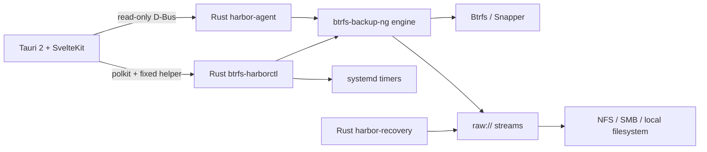

<p align="center">
  
</p>

<h1 align="center">Btrfs Harbor</h1>

<p align="center">
  <strong>⚓ Snapshots in. Systems back.</strong><br>
  Native Linux backup, verification, recovery and system replication for Btrfs.
</p>

<p align="center">
  <a href="https://github.com/GodsQuantum/btrfs-harbor/actions/workflows/harbor.yml"></a>
  <a href="LICENSE"></a>
  
  
  
  
</p>

<p align="center">
  <a href="README.md">English</a> ·
  <a href="README.fr.md">Français</a> ·
  <a href="README.zh-CN.md">简体中文</a>
</p>

<p align="center">
  
</p>

Btrfs Harbor turns **local Btrfs/Snapper snapshots into real off-host backups**. It adds mount-aware destinations, full + incremental Btrfs send streams, checksum verification, systemd scheduling, staged recovery and safe Proxmox LXC replication behind one native desktop UI.

A local snapshot on the same disk is useful, but it is **not** an off-host backup. Harbor keeps that distinction visible everywhere.

## ✨ Why Harbor?

- **Real full + incremental Btrfs backups** — preserve snapshot lineage instead of recopying everything.
- **NFS / SMB / local / SSH destinations** — including raw streams on ordinary filesystems.
- **No silent NAS fallback** — network destinations are positively identified before any write.
- **Verification built in** — optional checksum verification after backup.
- **Persistent scheduling** — UUID-scoped native systemd services and timers.
- **Recovery Kits** — portable topology, package, Snapper and boot information beside backups.
- **Staged recovery** — restore and verify away from the live root before activation.
- **Proxmox LXC replication** — deploy userspace into a stopped container with native snapshot/rollback.
- **Least-privilege desktop** — read-only D-Bus agent plus a fixed privileged helper; no generic root shell.
- **English / Français / 简体中文** — first-class UI and documentation.
- **No Docker runtime** — Harbor installs as a native Linux desktop application.

## 📦 Download & install

For most x86_64 Linux systems, use the **universal installer**. It installs the desktop app, Rust helpers, the included btrfs-backup-ng engine, systemd service, D-Bus policy and polkit integration together:

```bash
curl -LO https://github.com/GodsQuantum/BTRFS-Harbor/releases/download/v0.1.2/BTRFS-Harbor-0.1.2-linux-x86_64.run
chmod +x BTRFS-Harbor-0.1.2-linux-x86_64.run
./BTRFS-Harbor-0.1.2-linux-x86_64.run
```

Supported by the universal installer: **x86_64 Linux with glibc + systemd**. It can install required host tools through pacman, apt, dnf or zypper. Alpine/musl and non-systemd systems are not currently supported.

The release also provides:

- **DEB** — Debian / Ubuntu and derivatives.
- **RPM** — Fedora / RHEL-family / openSUSE-compatible package workflows.
- **Portable AppImage** — runs directly and does **not install Harbor**. Use it to inspect the computer and prepare a backup. System installation is only needed when you enable automatic/periodic `btrfs send` jobs that must keep running after the AppImage is closed.
- **SHA256SUMS** — checksums for every Linux release artifact.

## 🚀 Build from source on CachyOS / Arch Linux

The recommended source install uses the repository's native Arch package recipe:

```bash
git clone https://github.com/GodsQuantum/btrfs-harbor.git
cd btrfs-harbor
./install-cachyos.sh
```

The installer:

1. verifies it is running on a pacman-based system;
2. installs only the standard Arch build prerequisites;
3. builds the tracked `PKGBUILD` with `makepkg` as your normal user;
4. installs the resulting package through pacman;
5. enables the native `btrfs-harbor-agent.service`;
6. deletes its temporary build directory.

Then launch **Btrfs Harbor** from your application menu or run:

```bash
btrfs-harbor
```

> Harbor uses polkit for privileged operations. Do not run the desktop application as root.

### Manual Arch build

If you prefer to inspect every step:

```bash
sudo pacman -S --needed base-devel git
git clone https://github.com/GodsQuantum/btrfs-harbor.git
cd btrfs-harbor
cp packaging/arch/PKGBUILD /tmp/PKGBUILD.btrfs-harbor
# Review packaging/arch/PKGBUILD, then build it with makepkg in a clean build directory.
```

The same package recipe is intended to become the AUR package after public testing.

## 🛟 Your first backup

1. Open Harbor. It identifies the current computer and scans its mounted **Btrfs subvolumes**.
2. Review what Harbor found. Existing **Snapper** configurations and snapshots are detected; read-only snapshots that can be used by `btrfs send` are shown explicitly.
3. Choose what to protect. Harbor preselects recommended persistent Btrfs sources and leaves disposable/cache-style mounts out of the simple view.
4. Choose a destination. In normal mode there are only two choices: **Folder** or **SSH server**. For a folder, pick exactly one directory; Harbor silently detects whether it lives on local storage, NFS or SMB and keeps the mount-safety metadata internally. For SSH, enter `user@host:/path/to/backups`.
5. Choose the schedule directly: **hourly**, **daily**, **weekly**, or **after each Snapper snapshot**. Verification after backup stays enabled by default. Advanced mode is only for retention and low-level options.
6. Click **Save & enable automatic backups**. If you started from the portable AppImage, this is the point where Harbor asks for polkit permission to install the system components required for periodic/background `btrfs send`; the AppImage itself remains portable.
7. Run one manual backup and confirm the result becomes **BACKED UP** and **VERIFIED**.
8. Perform a staged restore test before relying on Harbor for unique data.

Nothing is pre-filled with a demo IP, machine name or source path in the native first-run flow: Harbor uses the computer it is actually running on.

## 🧭 What the status means

Harbor deliberately separates local snapshots from off-host protection:

| State | Meaning |
| --- | --- |
| **LOCAL** | Snapshot exists only on the source machine |
| **BACKED UP** | A destination contains the snapshot stream |
| **VERIFIED** | Stored raw stream passed verification |
| **FULL** | Independent full send |
| **INCREMENTAL** | Send references a valid parent chain |
| **RESTORE TESTED** | A staged recovery rehearsal completed |

## 🧬 System Replica

Harbor can reuse Linux userspace on another target without pretending hardware state is portable.

- **Physical machine** — userspace plus explicit boot/hardware reconciliation.
- **VM** — userspace plus virtual-hardware reconciliation.
- **LXC** — userspace only; physical EFI/kernel state is excluded.

For a stopped Proxmox LXC, Harbor can create a native PVE rollback snapshot, mount the target rootfs, preserve target networking/hostname state, respect the actual LXC UID/GID namespace, reset machine identity and SSH host keys, then roll back automatically if deployment fails.

The LXC path has been rehearsed end-to-end on a disposable unprivileged ZFS-backed container.

## 🛡️ Safety model

### No silent local fallback

For NFS and SMB, Harbor stores the expected mount point **and** server/share. The helper checks the live mount table before a backup starts. The generated engine configuration also uses `require_mount` as a second guard.

### No arbitrary privileged shell

The desktop stays unprivileged. Read-only state comes from a narrow system D-Bus service. Mutating actions invoke only fixed, validated Harbor helper commands through polkit.

### Recovery is staged

```text
plan → verify chain → receive into staging → verify staging → reconcile → activate
```

Harbor refuses to overwrite the running root filesystem in place.

### Credentials stay out of Recovery Kits

Recovery Kits contain system intent and topology, not secret credential files.

## 🏗️ Architecture



Harbor is based on [berrym/btrfs-backup-ng](https://github.com/berrym/btrfs-backup-ng). The inherited Python engine keeps its mature send/receive, retention, raw metadata, locking and restore logic; Harbor adds a Rust control plane and native desktop.

## ⚙️ Example configuration

A fully generic example is provided at [examples/harbor.toml](examples/harbor.toml).

Harbor writes its live configuration under:

```text
/etc/btrfs-harbor/harbor.toml
```

Generated engine profiles live under:

```text
/var/lib/btrfs-harbor/generated/
```

## 🧪 Development

```bash
uv sync --frozen --extra test --extra dev
uv run --frozen pytest -q

cd harbor
cargo test --workspace --exclude btrfs-harbor-desktop --locked

cd desktop
pnpm install --frozen-lockfile
pnpm test
pnpm check
pnpm build
```

The repository also includes CI for the Python engine, Rust control plane, desktop frontend, Tauri build and packaging files.

## 📦 Project status

Btrfs Harbor is an early public **v0.1**. Core backup, verification, staged recovery and stopped-target LXC replication paths have been exercised with disposable integration rehearsals.

**Do not make an unreleased backup tool the only copy of important data.** Keep another backup and prove a restore before trusting any backup workflow.

## 🤝 Upstream heritage

Btrfs Harbor is based on **btrfs-backup-ng** by Michael Berry and contributors. The inherited engine remains MIT licensed and the upstream history is preserved. The original upstream README is kept at [docs/upstream/UPSTREAM_ENGINE_README.md](docs/upstream/UPSTREAM_ENGINE_README.md).

## 📄 License

MIT — see [LICENSE](LICENSE).
