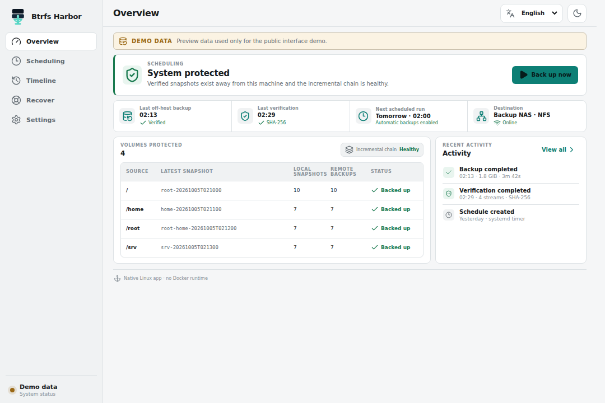
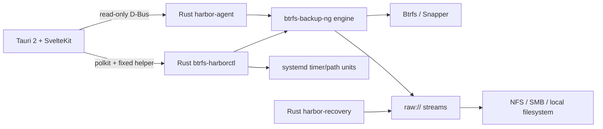

<p align="center">
  
</p>

<h1 align="center">Btrfs Harbor</h1>

<p align="center">
  <strong>⚓ Snapshots in. Systems back.</strong><br>
  Native Linux backup, verification, recovery and system replication for Btrfs.
</p>

<p align="center">
  <a href="https://github.com/GodsQuantum/btrfs-harbor/actions/workflows/harbor.yml"></a>
  <a href="LICENSE"></a>
  
  
  
  
</p>

<p align="center">
  <a href="README.md">English</a> ·
  <a href="README.fr.md">Français</a> ·
  <a href="README.zh-CN.md">简体中文</a>
</p>

<p align="center">
  
</p>

Btrfs Harbor turns **local Btrfs/Snapper snapshots into real off-host backups**. It adds mount-aware destinations, full + incremental Btrfs send streams, checksum verification, systemd scheduling, staged recovery and safe Proxmox LXC replication behind one native desktop UI.

A local snapshot on the same disk is useful, but it is **not** an off-host backup. Harbor keeps that distinction visible everywhere.

## v0.2.6-rc.11 (unpublished preview) — supervised rescue ISO and ReaR recovery

- **Back up now** remains one-click Btrfs + mounted EFI backup.
- A separate **Create rescue ISO** action uses installed ReaR 2.9 with a Harbor-provided isolated configuration; no changes to /etc/rear. It builds locally, checks ISO9660 and SHA-256, and atomically publishes to the selected backup destination with a live mount guard.
- The bundled ReaR rescue hook can stage verified Btrfs volumes and EFI, match the received subvolume UUIDs to ReaR's rebuilt mounts, validate and rewrite fstab UUIDs, then defer bootloader and initramfs finalization to ReaR.
- **UEFI blank-disk integration passed (minimal Linux only):** an independently created GPT disk received Harbor's Btrfs + FAT32 EFI archives, had its fstab UUIDs remapped and booted restored Linux /sbin/init twice in QEMU/OVMF ([CI evidence](https://github.com/GodsQuantum/BTRFS-Harbor/actions/runs/38058403995)). **Not universal disaster-recovery certification:** CachyOS/Arch, Fedora, full installed Ubuntu, LUKS, UKI, other bootloaders, non-Btrfs data, v2 automatic pruning and checkpointed SSH remain unqualified. Keep an independent backup.

## v0.2.6-rc.10 — capture separate EFI and boot files

- The **Back up now** action captures native Btrfs volumes and separately mounted FAT32 EFI and ext4 boot files in the same durable machine-set transaction.
- Boot files have independent SHA-256 verification, safe mount detection, and resumable catalog state. Stage recovery restores to a new empty folder, never overwrites live disks.
- An EFI partition declared in /etc/fstab but unmounted fails closed.
- **Still not a bootable full-system recovery**: creating a rescue ISO, recovering GPT/LUKS, bootloaders, initramfs and Secure Boot must pass QEMU/OVMF tests first. Unrelated non-Btrfs data, SSH-v2 resumability, and automated pruning remain unsupported.

## v0.2.6-rc.9 — Back up now on the home screen

- A prominent **Back up now** button on the overview backs up all detected persistent Btrfs subvolumes using the existing durable machine-set v2 transaction.
- Native Btrfs snapshot users now see the backup panel even without Snapper.
- A single click resumes one unfinished backup before creating a new set. Multiple unfinished jobs require an explicit choice. Network destination identity is checked before transfer.
- Experimental: EFI, non-Btrfs volumes and bootable blank-disk restoration are still unavailable; v2 SSH checkpointing and automatic pruning remain unfinished.

## v0.2.6-rc.8 — crash-safe Btrfs/NFS supervised preview

- Automatic v2 incremental chains now have a maximum of **7 links by default**; the next save is a full independently restorable anchor (configurable 1–256). A read-only retention plan is available; automatic deletion is not enabled.

- Multi-volume snapshot names are journaled **before** creation; after a crash,
  Harbor can reattach the exact readonly snapshot instead of leaving it unknown.
- The installed profile helper now creates target subdirectories via validated
  directory descriptors; a detached mount, symlink or path traversal is refused.
- An isolated GitHub-hosted **real NFSv4** end-to-end test successfully
  exercised SIGKILL, NFS unmount/remount, checksum-preserving checkpoint Resume
  and restored-content SHA-256 verification.
- Separate tests cover disposable mount detachment and target ENOSPC recovery.
- Scheduled profiles can explicitly opt into the same v2 resume engine in Advanced
  options; previously installed profiles keep their existing engine by default.
- Recovery Kit documents are now written atomically under mount-pinned,
  no-symlink directory handles; an absent NAS cannot receive fallback writes.
- Privileged acceptance includes actual NFS server outage during
  send, 101 real Btrfs tests, multivolume crash replay and ENOSPC recovery.
- The v2 scheduling mode does **not** yet enforce configured retention.
  SSH-v2 and bootable bare-metal recovery remain unsupported features.
  See docs/RESEARCH_BOOT_REAR_2026-10-10.md for the recovery design gates.

**Not yet stable:** bootable UEFI disk reconstruction, SSH/scheduler migration
to checkpoint v2, and network-server failure *during* an active write remain
separate acceptance requirements. The published rc.7 binary does not contain
these unreleased changes.

## v0.2.6-rc.7 — supervised Btrfs volume-set prerelease

The native desktop preview now offers **Back up all Btrfs volumes**, one
durable machine-set catalog, full then parent-verified incremental streams for
each selected mounted Btrfs subvolume, Resume, and **Recover from destination
backup** to an empty Btrfs staging folder. No original profile is needed for
staged recovery. Tested with real nested root/home Btrfs transfers and restores.

**Honest limits:** EFI, non-Btrfs partitions, disconnected/unmounted sources,
SSH and legacy scheduled jobs are not included in these machine sets. Bootable
system reconstruction, actual NFS outage/return, and live graphical systray
acceptance still require validation. Do not use this preview as the sole backup.
This is a supervised prerelease; stable v0.2.5 remains unchanged.

## v0.2.6-rc.6 — portable recovery of historical archive names

The profile-free recovery screen accepts original raw archive names with dots, spaces or Unicode (within the engine's safe filename rules) and retains path-traversal protection. An additional privileged Btrfs integration test now exercises the **actual Harbor checkpointed backup engine**, durable raw catalog, incremental parent and recovery from a destination alone. This prerelease remains supervised; fully bootable disaster recovery and NAS power-loss Resume are not yet qualified.

## v0.2.6-rc.5 — simpler backup, native Btrfs sources, direct recovery (supervised prerelease)

- Main page: choose source and latest/specific/new snapshot, browse an existing local/NFS/SMB destination directly, and send. Original profile configuration and technical diagnostics stay on separate pages.
- Existing host Snapper snapshots appear by number/date/description. Where Snapper is absent, Harbor-owned readonly **native Btrfs** snapshots can be listed/created on actual Btrfs subvolume roots; no changes to Snapper configs or mounts.
- Directories are prepared using directory-file-descriptor-relative writes, mount identity is pinned even for local/removable drives, and the checkpointed sender uses native systray and pause/resume metadata. It does not fabricate progress percentages.
- A fresh Linux install can choose a directory containing Harbor raw archives and stage a restore **without the original profile**. Staging is not itself an automatic bootable disk replacement.
- **Not a universal/general availability guarantee:** native snapshot creation requires a real writable Btrfs subvolume, other persistent nested subvolumes must be selected separately, SSH/schedules still use the legacy engine, live NFS outage/restart acceptance is pending, and unattended system/EFI/bootloader restoration is not supported yet. Keep verified backups.

## v0.2.6-rc.4 — persistent portable backup destinations

- Portable AppImage profiles now save and reload without requiring the installed Harbor system agent or an unrelated systemd service. The application writes a validated, atomic, user-only configuration file in its standard per-user application configuration directory.
- The resumable backup card refuses empty destinations, filesystem root and malformed double-slash paths. It explains what to correct instead of surfacing a misleading filesystem "No such file" error.
- The primary backup control also appears in portable mode when a Snapper-backed source is configured. This does not add an automatic schedule or claim that non-Snapper sources have been backed up.
- Earlier interrupted backups and mount points are left untouched; the existing NFSv4 atomic publishing fix remains.

## v0.2.6-rc.3 — NFS compatibility hotfix

Fixes **NFSv4 backups that did not start after clicking Send latest**: certain Linux NFS exports reject atomic renameat2 NOREPLACE with EINVAL. Harbor now uses an **atomic, no-overwrite hard-link fallback** on the same directory when unsupported, with no mount changes. On failures before any durable part or journal exists, Snapper source/parent cleanup leases are safely released after verifying the original mount identity. The interface still reports start errors and a real send/restore acceptance test remains necessary.

## v0.2.6-rc.2 — resumable Btrfs backup preview

**One primary manual backup control** on the Overview: choose the latest stable Snapper snapshot, start, pause, stop or resume. The competing legacy manual button was removed. **The initial send is a full standalone base**; subsequent sends automatically use a verified, present base and matching pinned read-only local parent, otherwise safely fall back to a full send. Source and parent Snapper cleanup pins are retained until the transaction is complete. Checkpoint status remains visible after reopening the application because it is read from durable manifests; detailed schedules, volumes and diagnostics are collapsed. Missing Snapper sources are explicitly listed as **not included**, never falsely displayed as protected.

**Current limitations (important):** the unified manual control currently supports Snapper-configured local/NFS/SMB raw sources. Sources without Snapper, existing systemd scheduled jobs and legacy SSH backup flows have **not yet been migrated** to the resumable worker. Real NFS interruption and end-to-end restore acceptance still require testing; use this as a supervised prerelease, not your only backup. Shutdown-after-success is **not enabled** in this build; the old one-time shutdown service has been stopped and is not part of Harbor. The prior v0.2.6-rc.1 remains available for rollback.

## v0.2.6-rc.1 — checkpointed Resume preview

**Experimental native desktop controls:** Send latest stable Snapper snapshot, select a specific snapshot number, create a new snapshot, and Pause / Stop / Resume / Discard partial. History now reads real manifests, including private journals with polkit when required. Snapper cleanup pins protect unfinished source snapshots. The legacy Back up now button and existing systemd timers are still on the original backup engine; they are NOT checkpointed-v2 sends.

**Experimental CLI:** raw checkpoint-v2 start/resume/list/status/pause/stop/discard. Start and Resume require --experimental, non-network local targets require --allow-local, and Discard requires explicit confirmation. Resume regenerates and checks the raw Btrfs send locally from byte zero, but NEVER retransmits committed destination frames. Legacy v0.2.5 partials without manifests cannot be resumed.

**Release-candidate limitations:** Real interrupted Btrfs full/incremental send/receive, a physical NFS-outage test, independent v2 systemd timers, and all package/distribution acceptance remain pending. Use only for supervised tests, not as your only disaster-recovery backup. Stable legacy raw/SSH behavior is preserved.

## ✨ Why Harbor?

- **Real full + incremental Btrfs backups** — preserve snapshot lineage instead of recopying everything.
- **NFS / SMB / local / SSH destinations** — including raw streams on ordinary filesystems.
- **No silent NAS fallback** — network destinations are positively identified before any write.
- **Verification built in** — optional checksum verification after backup.
- **Persistent scheduling** — UUID-scoped native systemd services and timers.
- **Recovery Kits** — portable topology, package, Snapper and boot information beside backups.
- **Staged recovery** — restore and verify away from the live root before activation.
- **Proxmox LXC replication** — deploy userspace into a stopped container with native snapshot/rollback.
- **Least-privilege desktop** — read-only D-Bus agent plus a fixed privileged helper; no generic root shell.
- **English / Français / 简体中文** — first-class UI and documentation.
- **No Docker runtime** — Harbor installs as a native Linux desktop application.

The current supervised candidate is **v0.2.6-rc.7** (subject to release artifact verification). Portable checkpoint sends support existing Snapper snapshots and Harbor-owned native Btrfs snapshots on verified subvolume roots. Comprehensive nested-volume coverage, disaster recovery, real interrupted NFS resumes, and all-distribution qualification are **not yet verified**.

## 📦 Download & install

The easiest way to **try Harbor or run manual backups** is the **Portable AppImage**. It stays portable: opening it does not install Harbor. It can detect the current Btrfs layout, choose sources and destinations, validate the target, browse backup snapshots, run **Back up now**, and stage a restore. Privileged Btrfs operations use polkit only when needed.

If you close the Harbor window while a manual backup is running, Harbor explains that the backup will continue, hides to a **temporary system-tray icon**, and keeps the transfer alive. The tray menu can reopen Harbor or **stop the active backup**. The tray disappears automatically when the run finishes.

Install Harbor on the system only when you want **scheduled/background backups that start by themselves** while Harbor is not open: systemd scheduling, startup integration and “after each Snapper snapshot” triggers.

The release provides:

- **Portable AppImage** — complete manual backup + recovery UI without system installation.
- **Universal `.run` installer** — x86_64 glibc + systemd Linux; installs persistent automation and may install required host tools through pacman, apt, dnf or zypper.
- **DEB** — Debian / Ubuntu and derivatives.
- **RPM** — Fedora / RHEL-family / openSUSE-compatible workflows.
- **SHA256SUMS** — checksums for every Linux release artifact.

Universal installer:

```bash
curl -LO https://github.com/GodsQuantum/BTRFS-Harbor/releases/download/v0.2.5/BTRFS-Harbor-0.2.5-linux-x86_64.run
chmod +x BTRFS-Harbor-0.2.5-linux-x86_64.run
./BTRFS-Harbor-0.2.5-linux-x86_64.run
```

Harbor **prefers a compatible system `btrfs-backup-ng` (>= 0.9.12)** when one is already installed. Otherwise it uses the compatible engine bundled with Harbor. Harbor no longer replaces or conflicts with a user-installed upstream engine.

**Simplest intended user journey:** [Backup → progress/resume → restore](docs/PRODUCT_FLOW_SIMPLE.md). This is the acceptance contract; current prereleases still have explicitly recorded limitations.\n\n## 🐧 Linux support

Harbor is capability-driven rather than tied to a distro name.

- **Manual backup + recovery:** requires Linux, Btrfs userspace tools and the capabilities used by the selected workflow. The Portable AppImage does not require Harbor to be installed.
- **Persistent automatic scheduling:** additionally requires systemd. A non-systemd Btrfs system remains usable for manual backup/recovery; Harbor simply reports automatic scheduling as unavailable.
- **Tier-A release families:** Arch/CachyOS, Debian/Ubuntu, Fedora and openSUSE are exercised as representative glibc/systemd/Btrfs families.
- **Compatibility qualification:** current four-family CI only checks package-manager availability and installer shell syntax. It does **not** prove that full/incremental send, interrupted Resume or receive/restore work on each distribution. The current official binary is Linux x86_64/glibc, not universal across architectures or musl distributions; real support must be validated on each supported platform.

See [distribution portability and release gates](docs/PORTABILITY_AND_RELEASE_GATES.md) for full Btrfs send/restore acceptance criteria.
- **Other glibc/systemd distributions:** supported by detected capabilities rather than an allowlist.
- **Package/install channels:** the universal `.run` detects pacman, apt, dnf or zypper. Native DEB/RPM/Arch recipes remain available where appropriate.

The legacy `install-cachyos.sh` name is retained only as a compatibility shim and delegates to the distro-neutral `install-linux.sh`. It contains no CachyOS-specific installation logic.

## 🛠️ Build from source

Source builds are for contributors and packagers. They use the same Python, Rust and Svelte/Tauri toolchain documented under **Development** below. Arch users may additionally inspect `packaging/arch/PKGBUILD`; that recipe is an Arch packaging option, not Harbor's portability layer.

> Harbor uses polkit for privileged operations. Do not run the desktop application as root.

## 🛟 Your first backup

1. Open Harbor. It identifies the current computer and scans its mounted **Btrfs subvolumes**, Snapper configurations and existing sendable read-only snapshots.
2. Under **What will be backed up**, review the detected persistent subvolumes. Harbor presents human labels first and keeps `@`, mount paths and Snapper details secondary.
3. Choose a destination:
   - **Folder** — select exactly one directory and press **Validate**. Harbor detects local/NFS/SMB internally and keeps mount-safety details out of the normal UI.
   - **SSH server** — enter host, user, port and remote folder, then test the connection.
4. Click **Back up now**. This works from the Portable AppImage without installing Harbor.
5. If you want recurring/background backups, choose the schedule and click **Install Harbor for automatic backups**. Installation exists for persistence/automation, not for manual backup.
6. Confirm the first run becomes **BACKED UP** and **VERIFIED**.
7. Open **Recover**, select a real backup snapshot and perform a staged restore test.

Nothing is pre-filled with a demo IP, machine name, recent directory or private source path in the native first-run flow.

## 🧭 What the status means

Harbor deliberately separates local snapshots from off-host protection:

| State | Meaning |
| --- | --- |
| **LOCAL** | Snapshot exists only on the source machine |
| **BACKED UP** | A destination contains the snapshot stream |
| **VERIFIED** | Stored raw stream passed verification |
| **FULL** | Independent full send |
| **INCREMENTAL** | Send references a valid parent chain |
| **RESTORE TESTED** | A staged recovery rehearsal completed |

## ♻️ Recover a snapshot

The **Recover** tab reads the real backup repository and lists available snapshots newest first. Recovery starts by asking whether you are **replacing this machine** (for example a fresh NVMe in the same computer) or **migrating to another machine**. A migration asks for a new hostname and plans regeneration/adaptation of machine identity, SSH host keys, storage UUID references, initramfs and boot state so the source and restored computers can coexist safely.

Choose the protected subvolume, destination and exact snapshot, then restore it into a separate **Btrfs staging location**. Harbor verifies the received data before considering the rehearsal complete.

- A non-root subvolume can be staged from the running system.
- The live `/` root is never overwritten in place. Root/system recovery is intentionally redirected to a **rescue/live-ISO workflow** using the Recovery Kit.
- The Recovery Kit records system topology, `fstab`/`crypttab`, Snapper configuration, package inventories, boot/initramfs information and Harbor intent beside the backup.
- Btrfs Assistant can still be useful afterwards for inspecting or rolling back local Snapper snapshots, but Harbor does not require it for receiving the off-host backup.

A Btrfs snapshot does not automatically include EFI partitions, partition tables or secrets outside the selected Btrfs subvolumes. Harbor therefore reports recovery coverage instead of promising “whole-computer recovery” when those prerequisites are not covered.

## 🧬 System Replica

Harbor can reuse Linux userspace on another target without pretending hardware state is portable.

- **Physical machine** — userspace plus explicit boot/hardware reconciliation.
- **VM** — userspace plus virtual-hardware reconciliation.
- **LXC** — userspace only; physical EFI/kernel state is excluded.

For a stopped Proxmox LXC, Harbor can create a native PVE rollback snapshot, mount the target rootfs, preserve target networking/hostname state, respect the actual LXC UID/GID namespace, reset machine identity and SSH host keys, then roll back automatically if deployment fails.

The LXC path has been rehearsed end-to-end on a disposable unprivileged ZFS-backed container.

## 🛡️ Safety model

### No silent local fallback

For NFS and SMB, Harbor stores the expected mount point **and** server/share. The helper checks the live mount table before a backup starts. The generated engine configuration also uses `require_mount` as a second guard.

### No arbitrary privileged shell

The desktop stays unprivileged. Read-only state comes from a narrow system D-Bus service. Mutating actions invoke only fixed, validated Harbor helper commands through polkit.

### Recovery is staged

```text
plan → verify chain → receive into staging → verify staging → reconcile → activate
```

Harbor refuses to overwrite the running root filesystem in place.

### Credentials stay out of Recovery Kits

Recovery Kits contain system intent and topology, not secret credential files.

## 🏗️ Architecture



Harbor is based on [berrym/btrfs-backup-ng](https://github.com/berrym/btrfs-backup-ng). The inherited Python engine keeps its mature send/receive, retention, raw metadata, locking and restore logic; Harbor adds a Rust control plane and native desktop.

## ⚙️ Example configuration

A fully generic example is provided at [examples/harbor.toml](examples/harbor.toml).

Harbor writes its live configuration under:

```text
/etc/btrfs-harbor/harbor.toml
```

Generated engine profiles live under:

```text
/var/lib/btrfs-harbor/generated/
```

## 🧪 Development

```bash
uv sync --frozen --extra test --extra dev
uv run --frozen pytest -q

cd harbor
cargo test --workspace --exclude btrfs-harbor-desktop --locked

cd desktop
pnpm install --frozen-lockfile
pnpm test
pnpm check
pnpm build
```

The repository also includes CI for the Python engine, Rust control plane, desktop frontend, Tauri build and packaging files.

## 📦 Project status

Btrfs Harbor is an early public **v0.2**. Core backup, verification, staged recovery and stopped-target LXC replication paths have been exercised with disposable integration rehearsals.

**Do not make an unreleased backup tool the only copy of important data.** Keep another backup and prove a restore before trusting any backup workflow.

## 🤝 Upstream heritage

Btrfs Harbor is based on **btrfs-backup-ng** by Michael Berry and contributors. The inherited engine remains MIT licensed and the upstream history is preserved. The original upstream README is kept at [docs/upstream/UPSTREAM_ENGINE_README.md](docs/upstream/UPSTREAM_ENGINE_README.md).

## 📄 License

MIT — see [LICENSE](LICENSE).
