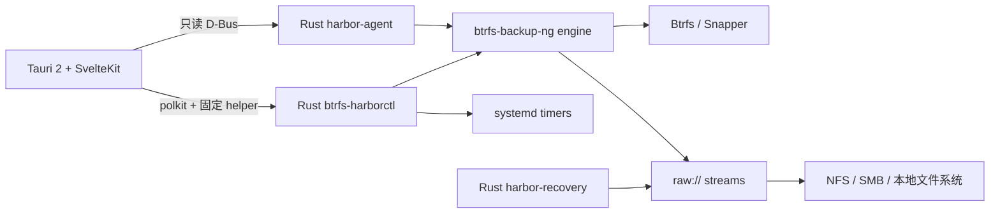

<p align="center">
  
</p>

<h1 align="center">Btrfs Harbor</h1>

<p align="center">
  <strong>⚓ Snapshots in. Systems back.</strong><br>
  面向 Linux 的原生 Btrfs 备份、验证、恢复与系统复制工具。
</p>

<p align="center">
  <a href="https://github.com/GodsQuantum/btrfs-harbor/actions/workflows/harbor.yml"></a>
  <a href="LICENSE"></a>
  
  
  
  
</p>

<p align="center">
  <a href="README.md">English</a> ·
  <a href="README.fr.md">Français</a> ·
  <a href="README.zh-CN.md">简体中文</a>
</p>

<p align="center">
  
</p>

Btrfs Harbor 把**本机 Btrfs/Snapper 快照变成真正的异机备份**。它在一个原生桌面应用中整合了受保护的目标挂载、完整 + 增量 Btrfs send、校验、systemd 定时、分阶段恢复以及安全的 Proxmox LXC 系统复制。

同一块磁盘上的本地快照很有用，但它**不是**异机备份。Harbor 会始终明确区分这两种状态。

## rc.11 之后的 preview 分支（尚未发布，实验性，2026 年 10 月 10 日）

当前开发分支包含**不在已发布 rc.11 安装包中的新功能**。CI 成功并不等于新稳定版已发布。

- **已安装 Ubuntu 24.04 的恢复**：[GitHub CI](https://github.com/GodsQuantum/BTRFS-Harbor/actions/runs/38088918085) 安装真实的 Ubuntu/systemd 根文件系统，备份 Btrfs 和 EFI，恢复到另一块新 GPT 虚拟盘，并成功完成两次 OVMF UEFI 启动。尚未认证 Arch/CachyOS、Fedora、Limine、systemd-boot、LUKS、UKI 或 Secure Boot。
- **受限的实验性 SSH-v2 镜像**：[真实 SSH 故障 CI](https://github.com/GodsQuantum/BTRFS-Harbor/actions/runs/38088918056) 验证受限公钥、固定主机密钥、SHA-256 分块、断线和恢复。它只能镜像**本地/NFS 已完成的 checkpoint-v2 备份**，尚不能直接作为首页一键 SSH 目的地。参见 [SSH 安全指南](docs/SSH_V2_OPERATOR_2026-10-10.md)。
- **事务保留实验室**：[临时 runner 崩溃恢复 CI](https://github.com/GodsQuantum/BTRFS-Harbor/actions/runs/38089399910) 验证持久日志、隔离区、保护外来文件和断点恢复。因应用的并发读写锁及计划清理尚未完全验证，**自动删除仍禁用**。
- **桌面仍未完成认证**：真实 KDE Wayland/X11 托盘关闭/重新打开、进度、独立 VM 安装包和不同 UEFI 引导程序。务必保留其他独立且验证过的备份。

## v0.2.6-rc.11（已发布预览版）— ReaR 救援 ISO 与恢复

**2026 年 10 月 10 日已发布：**[v0.2.6-rc.11 正式预发布页面](https://github.com/GodsQuantum/BTRFS-Harbor/releases/tag/v0.2.6-rc.11)，包含经过校验的 AppImage、DEB、RPM、.run 和 SHA256SUMS。稳定的 `main` 仍为 v0.2.5。**尚未认证**无人值守的通用系统恢复。

- “立即备份”保留 Btrfs 和已挂载 EFI 分区数据。
- “创建救援 ISO”使用隔离的 ReaR 2.9 配置，本地构建并使用 SHA-256 校验后安全地保存到选定的备份位置，不修改 /etc/rear。
- 恢复工具将已校验的 Btrfs/EFI 内容映射到 ReaR 重建的挂载点，并修正 fstab UUID，之后由 ReaR 配置引导加载器。
- **最小 Linux 的空盘 UEFI 恢复测试通过**：Harbor 在新的 GPT 磁盘上恢复 Btrfs/EFI，重映射 fstab UUID；QEMU/OVMF 两次启动均达到恢复后的 /sbin/init（[CI 记录](https://github.com/GodsQuantum/BTRFS-Harbor/actions/runs/38058403995)）。**这并非所有发行版的完整认证**：CachyOS/Arch、Fedora、已安装的 Ubuntu、LUKS、UKI、其他引导程序、非 Btrfs 数据、自动保留清理及 SSH v2 仍需验证。请保留独立备份。

**历史版本说明（rc.10 及更早）：**下文提及的尚未实现功能、未发布内容仅反映**对应旧版本发布当时**的状态，并非当前 rc.11 的功能清单。

## v0.2.6-rc.10 — EFI 和引导文件备份

- “立即备份”现在将已挂载的 FAT32 EFI 和独立 /boot 分区与 Btrfs 卷放在同一事务中。
- 引导档案用 SHA-256 检验，恢复到独立空目录，不写入现有分区；fstab 定义但未挂载的 EFI 会导致明确失败。
- **空盘可启动恢复尚未验证**：仍需 QEMU/OVMF 实际测试 GPT/LUKS/UEFI 引导修复，以及其他非 Btrfs 分区、SSH 续传和自动删除。

## v0.2.6-rc.9 — 首页立即备份

- 首页新增显眼的“立即备份”按钮，调用现有 v2 多子卷持久化备份流程。
- 不使用 Snapper 的原生 Btrfs 快照也可直接备份。
- 如果存在唯一中断任务，则一键恢复；多个任务时要求选择，传输前验证目标挂载身份。
- 仍为预览版：不包含 EFI/非 Btrfs 引导恢复，也未完成 SSH 断点续传和自动删除。

## v0.2.6-rc.8 — Btrfs/NFS 断线续传监督测试版

- v2 增量链默认最长为 **7 层**，到达上限后创建新的独立全量备份（可配置 1–256）。可只读查看保留计划；自动删除暂未启用。

- 在创建多卷快照**之前**持久记录快照标识；意外中断后可精确找回只读快照。
- 已安装的计划任务使用经过验证的目录描述符创建备份子目录，
  拒绝已卸载的目标、符号链接和路径穿越。
- 在隔离的 GitHub 环境中，通过**真实 NFSv4** 端到端测试：
  SIGKILL、中断后卸载/重新挂载、保留已提交检查点的续传，以及
  恢复数据的 SHA-256 校验。
- 另有独立测试覆盖挂载消失和目标空间不足的恢复行为。
- 可在高级选项中为每个计划任务显式启用 v2 续传引擎；
  现有计划任务默认仍保留原有引擎。
- Recovery Kit 使用经过挂载检查、禁止符号链接的目录描述符原子写入，
  避免 NAS 离线后误写本地挂载点目录。
- 实际测试包括传输中关闭 NFS 服务器、101 项 Btrfs 特权测试、
  多子卷崩溃续传及目标空间耗尽后的恢复。
- 注意：v2 定时任务**尚未执行已配置的自动保留策略**。
  SSH 续传及可启动的整机恢复尚未认证。
  参见 docs/RESEARCH_BOOT_REAR_2026-10-10.md。

**仍未达到稳定版要求：** 可启动 UEFI 整盘重建、SSH/计划任务迁移到
v2 检查点，以及传输中服务器直接断线的测试。已发布 rc.7 二进制
不包含此处所述的未发布更改。

## v0.2.6-rc.7 — Btrfs 多子卷备份监督测试版

原生桌面界面新增**备份所有 Btrfs 卷**：使用单一持久备份集目录，
对每个已挂载的 Btrfs 子卷执行完整备份及经过父快照验证的增量备份，
支持中断续传，并可仅凭备份目标目录恢复到空的 Btrfs 暂存目录，
无需旧电脑的配置。嵌套 root/home 子卷的真实发送和恢复已通过测试。

**明确限制：** 不包括 EFI、非 Btrfs 分区、未挂载或断开的磁盘、
SSH 和旧版计划任务。可启动系统重建、真实 NFS 断线恢复和图形托盘
操作仍需验证。请保留其他可靠备份。此版本仅供监督测试，稳定版 v0.2.5 保持不变。

## v0.2.6-rc.6 — 恢复历史备份名称

不依赖原配置的恢复界面支持包含点号、空格或 Unicode 字符的旧备份名称，同时仍防止路径遍历。新增真正 Btrfs 文件系统上的完整 Harbor 检查点引擎、增量备份及仅凭目标目录恢复测试。完整可启动系统恢复与断网续传仍需验证。

## v0.2.6-rc.5 — 简洁备份、原生 Btrfs 快照及免配置恢复（监督测试版）

- 首页直接选择最新、指定或新建快照，浏览现有本地/NFS/SMB 目标目录并发送。高级状态位于其他页面。
- 读取主机 Snapper 快照；没有 Snapper 时，可在真正的 Btrfs 子卷根目录创建或选择 Harbor 自有只读快照，不改动挂载或 Snapper 设置。
- 持久验证目标挂载身份（包括可移动磁盘），使用目录文件描述符安全创建子目录，提供原生托盘和检查点续传，不捏造进度百分比。
- 全新 Linux 系统无需原有配置，即可从 Harbor 原始备份目录选择恢复点并接收到 Btrfs 暂存目录；尚不能自动完成 EFI/引导程序和可启动系统替换。
- **限制：** 嵌套子卷需要分别选择；SSH/计划任务尚未统一；真实 NFS 中断与恢复仍待测试；请保留已验证的备份。

## v0.2.6-rc.4 — 便携版配置持久化

- AppImage 便携模式现在可以保存并重新加载备份配置，无需安装系统代理或服务。经过验证的配置会以仅限当前用户读取的权限原子写入标准用户配置目录。
- 可续传备份入口拒绝空路径、文件系统根目录及双斜杠等无效目标，并显示明确的错误信息。
- 配置 Snapper 来源后，便携模式的概览页同样显示主要备份操作。不会安装计划任务，也不会将没有 Snapper 的来源误报为已备份。
- 不更改现有挂载或旧备份文件。

## v0.2.6-rc.3 — NFS 兼容性修复

修复在部分 NFSv4 共享目录点击“发送最新快照”后备份无法启动的问题：这些共享目录不支持 renameat2 NOREPLACE（EINVAL）。现在使用同一目录内**原子且不覆盖现有文件的硬链接**作为回退，无需修改挂载设置。未生成部分文件或日志的初始失败会在验证挂载身份后安全释放 Snapper 保护。仍需真实 Btrfs/NFS 完整恢复验证。

## v0.2.6-rc.2 — 可续传 Btrfs 备份预发布版

**概览页面只有一个主要的手动备份入口**：发送最新稳定的 Snapper 快照、暂停、停止以及继续。已移除与之冲突的旧式手动备份按钮。**首次传输生成完整且独立的基础备份**；之后只有当远端完整可靠的基础备份和对应已保护的本地只读父快照均可用时才自动增量，否则安全地重新执行完整备份。Snapper 源及父快照均在事务完成前受到清理保护。重新打开应用后可从持久化清单恢复进度展示；诊断和高级设置默认折叠。不支持 Snapper 的来源会明确标注为**未包含**，不会误报为已备份。

**尚有限制：**统一的手动备份入口目前仅支持配置了 Snapper 的本地/NFS/SMB raw 来源。未配置 Snapper 的来源、现有 systemd 定时任务及传统 SSH 备份**尚未迁移**。真实 NFS 断线及完整 Btrfs 恢复仍需验收，不能将此预发布版本作为唯一灾备。此版**没有启用备份后自动关机**；旧版 v0.2.6-rc.1 可用于回退。

## v0.2.6-rc.1 — 检查点续传预发布版

**实验性桌面操作：**发送最新稳定 Snapper 快照、选择编号、创建快照，以及暂停、停止、继续和明确丢弃部分传输。历史页读取真实清单，私有清单需要 polkit 授权。Snapper 清理保护确保传输中的源快照不会被自动清理。传统“立即备份”按钮和现有 systemd 定时器仍使用旧引擎，**不是** v2 传输。

**实验性命令行：**raw checkpoint-v2 start/resume/list/status/pause/stop/discard。开始和继续需要 --experimental；非网络本地目标需要 --allow-local；丢弃需要确认。恢复会从头在本地重新生成并核验 Btrfs 流前缀，但不会向目标重传已提交的数据。无清单的 v0.2.5 旧 .part 文件不能续传。

**预发布限制：**真实 Btrfs 完整/增量中断与恢复、实际 NFS 断线、独立 v2 systemd 调度及跨发行版验收仍待完成。只能在监督下测试，不能作为唯一灾备。原有 raw/SSH 功能保留。

## ✨ 为什么选择 Harbor？

- **真正的完整 + 增量 Btrfs 备份** — 保留快照父链，而不是每次完整复制。
- **NFS / SMB / 本地 / SSH 目标** — 支持普通文件系统上的 raw stream。
- **不会静默回退到本地目录** — 写入前验证网络挂载身份。
- **内置验证** — 备份后可执行 checksum 校验。
- **原生持久化计划任务** — 每个 profile 使用独立 systemd service/timer。
- **Recovery Kit** — 在备份旁保存拓扑、软件包、Snapper 与启动信息。
- **分阶段恢复** — 先恢复和验证 staging，再考虑激活。
- **Proxmox LXC 复制** — 对已停止容器使用原生 snapshot/rollback。
- **最小权限桌面架构** — 只读 D-Bus agent + 固定 privileged helper，不提供通用 root shell。
- **English / Français / 简体中文** — UI 与文档均支持三种语言。
- **不需要 Docker runtime** — Harbor 是原生 Linux 桌面应用。

当前监督测试候选版本为 **v0.2.6-rc.7**（发布文件仍需验证）。检查点发送支持 Snapper 或在真实 Btrfs 子卷根目录由 Harbor 创建的只读快照。多个子卷的自动涵盖、真实 NFS 中断续传、完整系统恢复及所有发行版的验证仍未完成。

## 📦 下载与安装

最简单的试用方式是 **Portable AppImage**。它保持便携：启动时不会安装 Harbor。无需系统安装即可检测 Btrfs/Snapper、选择来源与目标、验证目标、执行**立即备份**、浏览已备份快照并进行分阶段恢复。需要 Btrfs 特权时才通过 polkit 提权。

手动备份正在运行时关闭 Harbor 窗口，Harbor 会提示备份将在**后台继续**，隐藏窗口并保留一个临时**系统托盘图标**。托盘菜单可以重新打开 Harbor 或**停止当前备份**；备份结束后托盘图标会自动消失。

只有在需要关闭 AppImage 后仍持续运行的**自动/后台备份**时才安装 Harbor，例如 systemd 计划任务、开机集成或“每次 Snapper 快照后”触发。

Release 提供：

- **Portable AppImage** — 无需安装即可手动备份和恢复。
- **通用 `.run` 安装器** — x86_64 glibc + systemd Linux，用于持久自动化。
- **DEB** — Debian / Ubuntu 及衍生发行版。
- **RPM** — Fedora / RHEL 系 / openSUSE。
- **SHA256SUMS** — 所有 Linux release 文件的校验值。

通用安装器：

```bash
curl -LO https://github.com/GodsQuantum/BTRFS-Harbor/releases/download/v0.2.5/BTRFS-Harbor-0.2.5-linux-x86_64.run
chmod +x BTRFS-Harbor-0.2.5-linux-x86_64.run
./BTRFS-Harbor-0.2.5-linux-x86_64.run
```

如果系统已经安装兼容的 **`btrfs-backup-ng` (>= 0.9.12)**，Harbor 会优先使用它；否则使用 Harbor 自带的兼容引擎。Harbor 不再替换或与用户安装的 upstream 引擎冲突。

## 🐧 Linux 支持

Harbor 根据**可用能力**工作，而不是绑定某个发行版名称。

- **手动备份 + 恢复：**需要 Linux、Btrfs 用户空间工具以及所选工作流需要的能力。Portable AppImage 不要求安装 Harbor。
- **持久自动计划：**另外需要 systemd。没有 systemd 的 Btrfs Linux 仍可使用手动备份/恢复；Harbor 只会把自动计划标记为不可用。
- **Tier-A 代表系列：**Arch/CachyOS、Debian/Ubuntu、Fedora 和 openSUSE。
- **兼容性验证：**四个发行版系列的现有 CI 测试仅检查包管理器与安装脚本语法，**不等于**已验证真实完整/增量发送、中断续传或恢复。官方 AppImage 目前面向 Linux x86_64/glibc，并不自动兼容其他 CPU 架构或 musl，仍需逐平台验收。

实际 Btrfs 备份和恢复验证要求参见[兼容性与发布门槛](docs/PORTABILITY_AND_RELEASE_GATES.md)。
- **其他 glibc/systemd 发行版：**按检测到的能力支持，不使用发行版 allowlist。
- **安装通道：**通用 `.run` 可检测 pacman、apt、dnf 或 zypper；DEB/RPM/Arch 配方作为可选原生通道保留。

旧的 `install-cachyos.sh` 只作为兼容 shim 保留，并委托给发行版无关的 `install-linux.sh`；其中不再包含 CachyOS 专用安装逻辑。

## 🛠️ 从源码构建

源码构建面向贡献者和打包者，使用下方 **开发** 章节中的 Python、Rust 和 Svelte/Tauri 工具链。Arch 用户仍可检查 `packaging/arch/PKGBUILD`，但它只是 Arch 打包方式，并不是 Harbor 的可移植性层。

> 特权操作通过 polkit 完成。不要用 root 用户启动桌面应用。

## 🛟 第一次备份

1. 打开 Harbor。它会识别当前机器并检测 **Btrfs 子卷**、Snapper 配置以及可发送的只读快照。
2. 在“要备份的内容”中确认持久化子卷。界面优先显示易懂名称，`@`、挂载路径和 Snapper 细节作为辅助信息。
3. 选择目标：
   - **文件夹** — 只选一个目录并点击**验证**；Harbor 在内部自动识别本地/NFS/SMB。
   - **SSH 服务器** — 填写主机、用户、端口和远程目录，然后测试连接。
4. 点击**立即备份**。Portable AppImage 无需安装 Harbor 即可执行。
5. 若需要自动/后台备份，再选择频率并点击**安装 Harbor 以启用自动备份**。
6. 确认第一次发送达到 **BACKED UP** 和 **VERIFIED**。
7. 打开**恢复**，选择真实备份快照并进行 staging 恢复测试。

首次启动不会自动显示演示 IP、最近目录、机器名或私人路径。

## 🧭 状态含义

| 状态 | 含义 |
| --- | --- |
| **LOCAL** | 快照只存在于源机器 |
| **BACKED UP** | 目标中已经存在对应 stream |
| **VERIFIED** | 存储的 raw stream 已通过验证 |
| **FULL** | 独立完整 send |
| **INCREMENTAL** | 使用有效父链的增量 send |
| **RESTORE TESTED** | staging 恢复测试已经成功 |

## ♻️ 恢复快照

**恢复**页会读取真实备份仓库，并按时间从新到旧列出可用快照。恢复首先区分**替换这台机器**（例如同一台电脑更换新 NVMe）和**迁移到另一台机器**。迁移模式会要求新的主机名，并规划重新生成或调整 machine-id、SSH 主机密钥、存储 UUID 引用、initramfs 和启动状态，使源机器与恢复后的机器可以安全共存。

然后选择子卷、目标和精确快照，恢复到独立的 **Btrfs staging** 位置；Harbor 会验证接收到的数据。

- 非 root 子卷可以在当前系统运行时恢复到 staging。
- Harbor 不会直接覆盖正在运行的 `/`。系统/root 恢复必须进入 **rescue/live ISO** 流程并结合 Recovery Kit。
- Recovery Kit 保存系统拓扑、`fstab`/`crypttab`、Snapper 配置、软件包清单以及 boot/initramfs 信息。
- 之后仍可使用 Btrfs Assistant 检查或回滚本地 Snapper 快照，但接收 Harbor 的异机备份并不依赖它。

Btrfs 快照不会自动包含 EFI 分区、分区表或所选子卷之外的机密数据，因此 Harbor 显示恢复覆盖范围，而不会错误承诺“整机一键恢复”。

## 🧬 System Replica

Harbor 可以把 Linux userspace 迁移到另一目标，但不会假设硬件状态可以直接复制。

- **物理机** — userspace + 明确的 boot/hardware 协调。
- **VM** — userspace + 虚拟硬件适配。
- **LXC** — 仅 userspace；排除物理 EFI 与内核状态。

对于已停止的 Proxmox LXC，Harbor 可以先创建原生 PVE rollback snapshot，挂载目标 rootfs，保留网络与 hostname，遵守容器真实 UID/GID namespace，重置 machine-id 和 SSH host keys，并在部署失败时自动 rollback。

## 🛡️ 安全模型

### 不允许静默本地回退

对于 NFS/SMB，Harbor 同时保存预期挂载点和 server/share。备份前 helper 会检查实时 mount table；生成的 engine 配置还会使用 `require_mount` 作为第二层保护。

### 不提供通用 root shell

桌面应用保持非特权运行。只读数据来自受限的系统 D-Bus 服务；修改操作只能通过经过验证的 Harbor 固定命令和 polkit 执行。

### 分阶段恢复

```text
plan → verify chain → receive into staging → verify staging → reconcile → activate
```

Harbor 拒绝直接覆盖正在运行的 root 文件系统。

### Recovery Kit 不包含凭据

Recovery Kit 保存系统意图和拓扑，但不会复制 secret credential 文件。

## 🏗️ 架构



Harbor 基于 [berrym/btrfs-backup-ng](https://github.com/berrym/btrfs-backup-ng)。成熟的 Python engine 继续负责 send/receive、retention、raw metadata、locking 与 restore；Harbor 在此基础上增加 Rust control plane 和原生桌面 UI。

## ⚙️ 示例配置

完全通用的示例位于 [examples/harbor.toml](examples/harbor.toml)。

实际配置文件：

```text
/etc/btrfs-harbor/harbor.toml
```

生成的 engine profile：

```text
/var/lib/btrfs-harbor/generated/
```

## 🧪 开发

```bash
uv sync --frozen --extra test --extra dev
uv run --frozen pytest -q

cd harbor
cargo test --workspace --exclude btrfs-harbor-desktop --locked

cd desktop
pnpm install --frozen-lockfile
pnpm test
pnpm check
pnpm build
```

## 📦 项目状态

Btrfs Harbor 当前是早期公开 **v0.2**。核心备份、验证、staging 恢复以及 stopped-target LXC replication 流程已经在一次性测试环境中完成验证。

**不要让未稳定的备份工具成为重要数据的唯一副本。** 保留另一份备份，并先证明恢复流程真正可用。

## 🤝 Upstream 继承

Btrfs Harbor 基于 Michael Berry 和贡献者维护的 **btrfs-backup-ng**。继承的 engine 继续使用 MIT 许可证，并保留 upstream 历史。原始 upstream README 位于 [docs/upstream/UPSTREAM_ENGINE_README.md](docs/upstream/UPSTREAM_ENGINE_README.md)。

## 📄 许可证

MIT — 参见 [LICENSE](LICENSE)。
