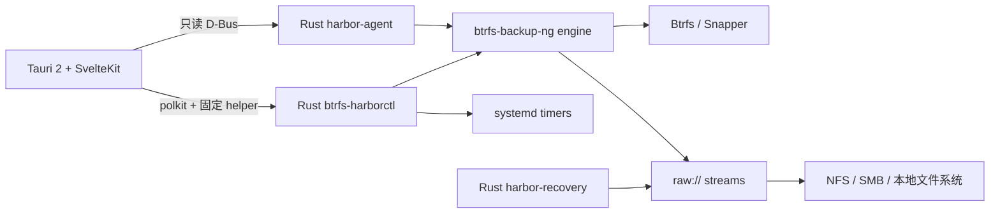

<p align="center">
  
</p>

<h1 align="center">Btrfs Harbor</h1>

<p align="center">
  <strong>⚓ Snapshots in. Systems back.</strong><br>
  面向 Linux 的原生 Btrfs 备份、验证、恢复与系统复制工具。
</p>

<p align="center">
  <a href="https://github.com/GodsQuantum/btrfs-harbor/actions/workflows/harbor.yml"></a>
  <a href="LICENSE"></a>
  
  
  
  
</p>

<p align="center">
  <a href="README.md">English</a> ·
  <a href="README.fr.md">Français</a> ·
  <a href="README.zh-CN.md">简体中文</a>
</p>

<p align="center">
  
</p>

Btrfs Harbor 把**本机 Btrfs/Snapper 快照变成真正的异机备份**。它在一个原生桌面应用中整合了受保护的目标挂载、完整 + 增量 Btrfs send、校验、systemd 定时、分阶段恢复以及安全的 Proxmox LXC 系统复制。

同一块磁盘上的本地快照很有用，但它**不是**异机备份。Harbor 会始终明确区分这两种状态。

## ✨ 为什么选择 Harbor？

- **真正的完整 + 增量 Btrfs 备份** — 保留快照父链，而不是每次完整复制。
- **NFS / SMB / 本地 / SSH 目标** — 支持普通文件系统上的 raw stream。
- **不会静默回退到本地目录** — 写入前验证网络挂载身份。
- **内置验证** — 备份后可执行 checksum 校验。
- **原生持久化计划任务** — 每个 profile 使用独立 systemd service/timer。
- **Recovery Kit** — 在备份旁保存拓扑、软件包、Snapper 与启动信息。
- **分阶段恢复** — 先恢复和验证 staging，再考虑激活。
- **Proxmox LXC 复制** — 对已停止容器使用原生 snapshot/rollback。
- **最小权限桌面架构** — 只读 D-Bus agent + 固定 privileged helper，不提供通用 root shell。
- **English / Français / 简体中文** — UI 与文档均支持三种语言。
- **不需要 Docker runtime** — Harbor 是原生 Linux 桌面应用。

## 🚀 CachyOS / Arch Linux 安装

推荐直接从 Git 仓库安装：

```bash
git clone https://github.com/GodsQuantum/btrfs-harbor.git
cd btrfs-harbor
./install-cachyos.sh
```

安装脚本会：

1. 检查当前系统是否使用 pacman；
2. 安装标准 Arch 构建依赖；
3. 以普通用户通过 `makepkg` 构建仓库中的 `PKGBUILD`；
4. 使用 pacman 安装生成的软件包；
5. 启用原生 `btrfs-harbor-agent.service`；
6. 删除临时构建目录。

安装后可从应用菜单启动 **Btrfs Harbor**，或运行：

```bash
btrfs-harbor
```

> 特权操作通过 polkit 完成。不要用 root 用户启动桌面应用。

## 🛟 第一次备份

1. 打开 **Protection**。
2. 创建 profile，并选择真正需要保留的 Btrfs 子卷。
3. 选择目标目录。对于已挂载的 NFS/SMB，Harbor 会识别实际挂载点和 server/share。
4. 设置保留策略、计划任务和 **Verify after backup**。
5. 保存并启用 profile。
6. 先手动运行一次备份。
7. 在 **Timeline / Activity** 中确认状态变为 **BACKED UP**，如果启用了校验，还应变为 **VERIFIED**。
8. 在依赖 Harbor 保存唯一数据之前，先执行一次 staging 恢复测试。

典型桌面配置可以通过现有 Snapper root 配置保护 `/`，再加入 `/home`、`/root` 或 `/srv` 等持久化子卷，而缓存和临时数据可以不备份。

## 🧭 状态含义

| 状态 | 含义 |
| --- | --- |
| **LOCAL** | 快照只存在于源机器 |
| **BACKED UP** | 目标中已经存在对应 stream |
| **VERIFIED** | 存储的 raw stream 已通过验证 |
| **FULL** | 独立完整 send |
| **INCREMENTAL** | 使用有效父链的增量 send |
| **RESTORE TESTED** | staging 恢复测试已经成功 |

## 🧬 System Replica

Harbor 可以把 Linux userspace 迁移到另一目标，但不会假设硬件状态可以直接复制。

- **物理机** — userspace + 明确的 boot/hardware 协调。
- **VM** — userspace + 虚拟硬件适配。
- **LXC** — 仅 userspace；排除物理 EFI 与内核状态。

对于已停止的 Proxmox LXC，Harbor 可以先创建原生 PVE rollback snapshot，挂载目标 rootfs，保留网络与 hostname，遵守容器真实 UID/GID namespace，重置 machine-id 和 SSH host keys，并在部署失败时自动 rollback。

## 🛡️ 安全模型

### 不允许静默本地回退

对于 NFS/SMB，Harbor 同时保存预期挂载点和 server/share。备份前 helper 会检查实时 mount table；生成的 engine 配置还会使用 `require_mount` 作为第二层保护。

### 不提供通用 root shell

桌面应用保持非特权运行。只读数据来自受限的系统 D-Bus 服务；修改操作只能通过经过验证的 Harbor 固定命令和 polkit 执行。

### 分阶段恢复

```text
plan → verify chain → receive into staging → verify staging → reconcile → activate
```

Harbor 拒绝直接覆盖正在运行的 root 文件系统。

### Recovery Kit 不包含凭据

Recovery Kit 保存系统意图和拓扑，但不会复制 secret credential 文件。

## 🏗️ 架构



Harbor 基于 [berrym/btrfs-backup-ng](https://github.com/berrym/btrfs-backup-ng)。成熟的 Python engine 继续负责 send/receive、retention、raw metadata、locking 与 restore；Harbor 在此基础上增加 Rust control plane 和原生桌面 UI。

## ⚙️ 示例配置

完全通用的示例位于 [examples/harbor.toml](examples/harbor.toml)。

实际配置文件：

```text
/etc/btrfs-harbor/harbor.toml
```

生成的 engine profile：

```text
/var/lib/btrfs-harbor/generated/
```

## 🧪 开发

```bash
uv sync --frozen --extra test --extra dev
uv run --frozen pytest -q

cd harbor
cargo test --workspace --exclude btrfs-harbor-desktop --locked

cd desktop
pnpm install --frozen-lockfile
pnpm test
pnpm check
pnpm build
```

## 📦 项目状态

Btrfs Harbor 当前是早期公开 **v0.1**。核心备份、验证、staging 恢复以及 stopped-target LXC replication 流程已经在一次性测试环境中完成验证。

**不要让未稳定的备份工具成为重要数据的唯一副本。** 保留另一份备份，并先证明恢复流程真正可用。

## 🤝 Upstream 继承

Btrfs Harbor 基于 Michael Berry 和贡献者维护的 **btrfs-backup-ng**。继承的 engine 继续使用 MIT 许可证，并保留 upstream 历史。原始 upstream README 位于 [docs/upstream/UPSTREAM_ENGINE_README.md](docs/upstream/UPSTREAM_ENGINE_README.md)。

## 📄 许可证

MIT — 参见 [LICENSE](LICENSE)。
